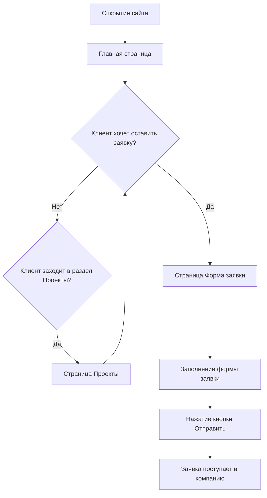

#### Запуск проекта

#### Скачайте архив проекта или склонируйте репозиторий

```sh
git@github.com:lkhusnullina/test-PluhSoft.git
```
#### Установите зависимости проекта
```sh
npm install
```
#### Запустите проект командой
```sh
npm run start
```
